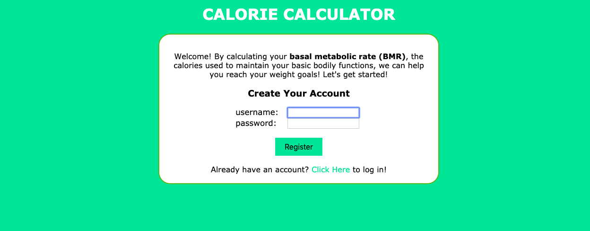
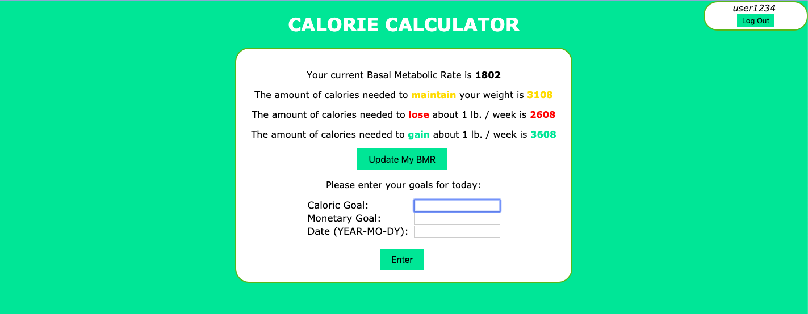
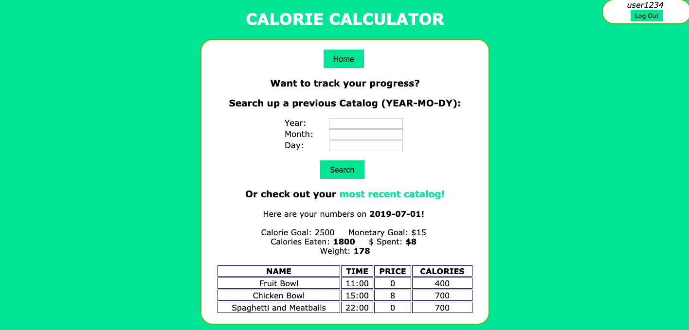

# Calorie Calculator

## Overview

Calorie Calculator is a web app that allows users to keep track of the number of calories they have eaten on a given day, aided by a calculation of their Basal Metabolic Rate and the number of calories they need to maintain, lose, or gain weight.
This app is a useful tool for those who are aiming to cut or maintain weight, gain muscle, or to manage their expenses.

Each registered user owns their own food catalog and will have the ability to set caloric and monetary goals for each day. As the day goes by, the user can add foods they have eaten to their catalog. The user will be prompted to enter the name of the food, the time it was consumed, the price, and most importantly, the total calories. As the user continues to add new items, the app notifies the user when they have reached the midpoint of their goals and when they have surpassed them. The user will be able to moderate their choices via a counter that displays how many calories they have eaten as well as another one that displays their total amount of money spent.

For each day a user completes, that information will be stored so the user may
track their progress over time with a feature that allows them to lookup previous catalogs by date, which include their weight at that given point in time.

## User Experience

### Creating a New Account

### Caloric Intake Suggestions

### Adding a New Food

### Looking Up Previous Catalogs

## Data Model

The application will store Users and an array of Catalog documents for each daily entry made by a user.

A **User** will contain the following properties:
- username (provided by passport)
- password (provided by passport)
- catalogs (array of Catalog documents)

A **Catalog** will contain the following properties:
- username (name of user that owns this catalog document)
- calorieGoal (the caloric goal for the day)
- curCal (the current caloric count for the day)
- moneyGoal (the monetary goal for the day)
- curMon (the current monetary count for the day)
- date (date of the current entry)
- foods (a list of foods the user has ate on this date)
- completed (determines if this catalog has been completed and saved)

## User Stories or Use Cases

1. As a non-registered user, I can register a new account with site.
2. As a user, I can log in to the site and.
3. As a user, I can add a new entry to my personal catalog list, inputting my goals for the specified date.
4. As a user, I can populate this new entry with food items I have ate throughout the day.
5. As a user, I can keep track of what I have eaten, my goals for the day, the amount of calories I
have ate, and the amount of money I have spent.
6. As a user, I can track my progress by looking up previous entries in my catalog by providing a past date.
